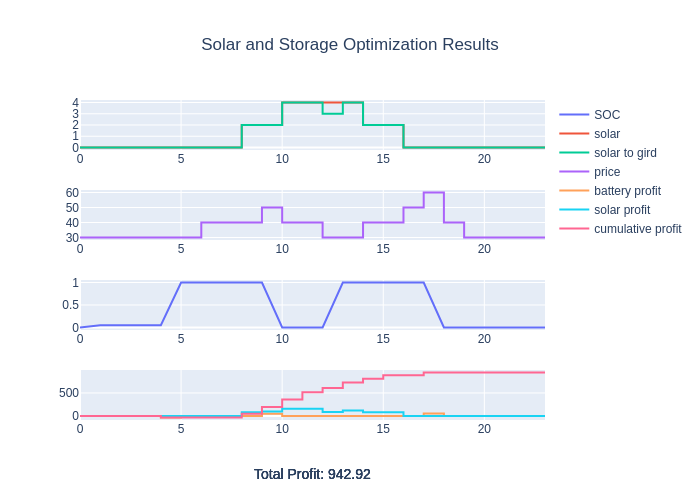
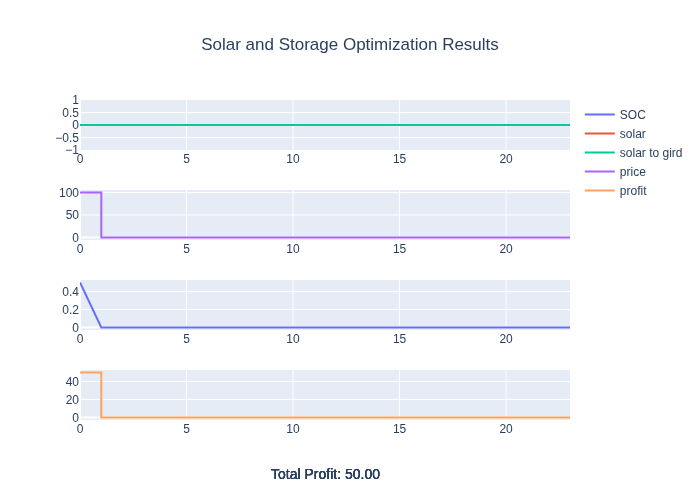

# Solar and Storage
<!-- ALL-CONTRIBUTORS-BADGE:START - Do not remove or modify this section -->
[](#contributors-)
<!-- ALL-CONTRIBUTORS-BADGE:END -->

A Python Library to run solar and storage optimization.
This uses mixed integer linear programming and maximises revenue made by charging and discharging the battery.
The model uses variable prices and a solar generation profile.

## Installation

```
pip install solar-and-storage
```

## Development
This repository uses [uv](https://docs.astral.sh/uv/) for local development and CI (`pyproject.toml` + `uv.lock`).

```
uv sync
uv run pytest src/tests
uv run ruff check .
```


## Example

Import the packages
```python
import numpy as np

from solar_and_storage import SolarAndStorage

```
Make the fake price and solar data
```python
# make prices
prices = np.zeros(24) + 30
prices[6:19] = 40
prices[9] = 50
prices[12:14] = 30
prices[16:18] = 50
prices[17] = 60

# make solar profile
solar = np.zeros(24)
solar[8:16] = 2.0
solar[10:14] = 4.0
```

Then run optimization
```python
solar_and_storage = SolarAndStorage(prices=prices, solar_generation=list(solar))
solar_and_storage.run_optimization()
result_df = solar_and_storage.get_results()
```


Now plot the data
```python
fig = solar_and_storage.get_figure()

fig.show(rendered="browser")
```




The first plot shows the solar profile, the second shows the prices that day. The third shows the battery profile.  Finally the fourth shows profit.
You can see that the battery charged from the solar site at the end of the solar maximum


### Starting with stored energy

Use `current_soc` to set the starting battery state of charge as a fraction of
the battery capacity. For example, a half-full battery can discharge during an
initial high-price period:

```python
prices = np.zeros(24)
prices[0] = 100
solar = np.zeros(24)

solar_and_storage = SolarAndStorage(
    prices=prices,
    solar_generation=list(solar),
    current_soc=0.5,
    battery_eta_charge=1,
    battery_eta_discharge=1,
)
result_df = solar_and_storage.get_results()
```



## API Server

The package includes a FastAPI wrapper to expose battery optimization functionality via HTTP endpoints.

### Installation

Install the API dependencies:

```bash
uv sync --group api
```

### Running the Server

Start the API server:

```bash
uv run uvicorn solar_and_storage.api.main:app --reload
```

The server will start at `http://localhost:8000`. View the auto-generated API documentation at `http://localhost:8000/docs`.

### API Usage

**Health Check:**

```bash
curl http://localhost:8000/health
```

**Optimization Endpoint:**

```bash
curl -X POST http://localhost:8000/api/v1/optimize \
  -H "Content-Type: application/json" \
  -d '{
    "prices": [30,30,30,30,30,30,40,40,40,50,40,40,30,30,40,40,50,60,40,30,30,30,30,30],
    "solar_generation": [0,0,0,0,0,0,0,0,2,2,4,4,4,4,2,2,0,0,0,0,0,0,0,0]
  }'
```

**Response Format:**

```json
{
  "status": "optimal",
  "message": "Optimization successful",
  "total_profit": 12.5,
  "schedule": [
    {
      "hour": 0,
      "power": -0.5,
      "battery_soc": 0.48,
      "solar_power_to_grid": 0.0,
      "profit": -15.0
    },
    ...
  ]
}
```

**Python Example:**

See `examples/api_example.py` for a complete Python example using the `requests` library.

### API Parameters

All battery parameters from the Python API are available as optional fields in the request:
- `battery_capacity` (default: 1.0 kWh)
- `power_rating` (default: 1.0 kW)
- `battery_eta_charge` (default: 0.95)
- `battery_eta_discharge` (default: 0.95)
- `battery_soc_min` (default: 0.0)
- `battery_soc_max` (default: 1.0)
- `grid_connection_capacity` (default: 4.0 kW)
- `current_soc` (default: 0.0)

## Thanks

Thanks you to the follow repos for inspiration
- https://github.com/ADGEfficiency/energy-py-linear
- https://github.com/wzyfrank/battery/
- https://github.com/greysonchung/Battery-Optimisation/
- https://github.com/edu230991/battery-optimization/
sdk-python-ci.yml

## Contributors ✨

Thanks goes to these wonderful people ([emoji key](https://allcontributors.org/docs/en/emoji-key)):

<!-- ALL-CONTRIBUTORS-LIST:START - Do not remove or modify this section -->
<!-- prettier-ignore-start -->
<!-- markdownlint-disable -->
<table>
  <tbody>
    <tr>
      <td align="center" valign="top" width="14.28%"><a href="https://github.com/peterdudfield"><br /><sub><b>Peter Dudfield</b></sub></a><br /><a href="https://github.com/openclimatefix/solar-and-storage/commits?author=peterdudfield" title="Code">💻</a></td>
      <td align="center" valign="top" width="14.28%"><a href="https://github.com/gilbertgong"><br /><sub><b>gilbertgong</b></sub></a><br /><a href="https://github.com/openclimatefix/solar-and-storage/commits?author=gilbertgong" title="Code">💻</a></td>
      <td align="center" valign="top" width="14.28%"><a href="https://github.com/davidhuanggg"><br /><sub><b>davidhuanggg</b></sub></a><br /><a href="https://github.com/openclimatefix/solar-and-storage/commits?author=davidhuanggg" title="Code">💻</a></td>
    </tr>
  </tbody>
</table>

<!-- markdownlint-restore -->
<!-- prettier-ignore-end -->

<!-- ALL-CONTRIBUTORS-LIST:END -->

This project follows the [all-contributors](https://github.com/all-contributors/all-contributors) specification. Contributions of any kind welcome!
